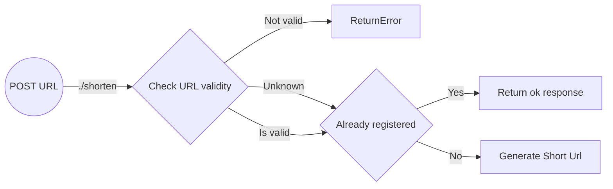

# Shorten URL

As a user, I'd like to apply a URL to shorten into a neat link.
  
EG:  
`https://docs.github.com/en/actions/learn-github-actions/contexts#github-context` becomes
`https://urls.valtech.com/3nlard098uf`

## User stories

> `TODO`

## API-flow

## Wire-frames

> `TODO`
