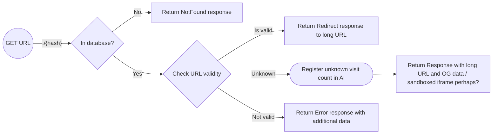

# Visit URL

As a user, I'd like to visit a shortened URL and get to see my content.
  
EG:  

`https://urls.{company}.com/3nlard098uf` will redirect to
`https://docs.github.com/en/actions/learn-github-actions/contexts#github-context`

When a user get's the eventual preview page when a visited url is neither Blocked or Valid a user should have the chance to report a URL to be blocked.

## User stories

> `TODO`

## API-flow

> **Note:**
> Because we don't want to have to allowlist every unknown URL that is shortened we measure the amount of visits and use the counter to determine whether it needs to be added to the valid URL list.

> **Note:**
> When a URL is blocked by an admin either for being malicious or if it's on the block list a user will see an error page, however the API response shall be similar to when an unknown url is loaded.

## Wire-frames

> `TODO`
