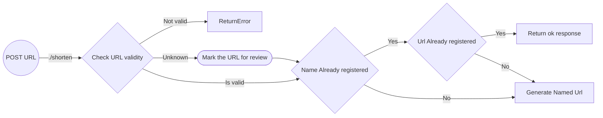

# Create named URL

As an admin, I'd like to create a named link for a URL.
  
EG:  
`https://www.mibo.com/room/lajsdfaoiue993lss` becomes
`https://urls.{company}.com/hr/newyears-mibo`

## User stories

> `TODO`

## API-flow

## Wire-frames

> `TODO`
