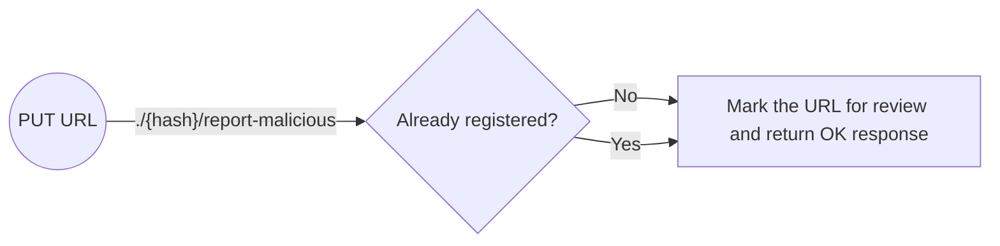

# Manage threat

As an admin, I would like to block a possibly malicious URL and mark it for review.

## User stories

> `TODO`

## API-flow

```mermaid
graph LR
    Report(( PUT URL )) --> |"./{hash}/report-malicious"| Report_ExistingUrl
    Report_ExistingUrl{Already registered?}
    Report_ExistingUrl --> |No| Report_MarkForReview[Mark the URL for review and return OK response]
    Report_ExistingUrl --> |Yes| Report_MarkForReview[Mark the URL for review and return OK response]
```

## Wire-frames

> `TODO`
