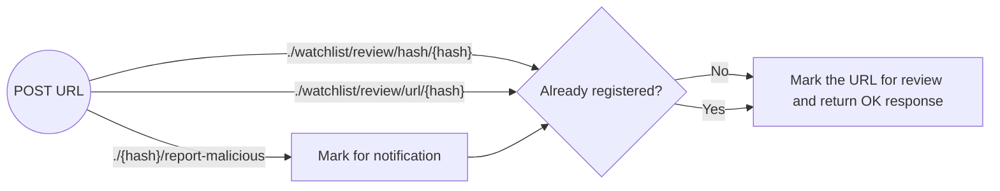
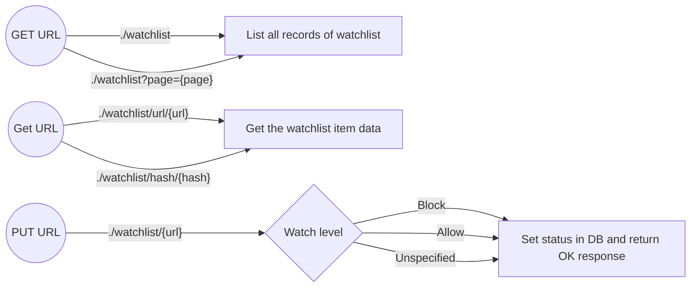
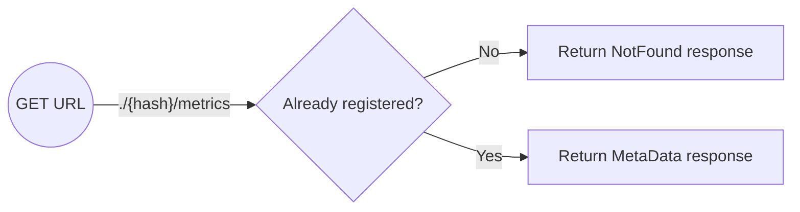

# Manage threat

As an admin, I would like to block a possibly malicious URL and mark it for review.

## User stories

> `TODO`

## API-flow

For the users:

> **Note:** both review and report do the same thing.
> However, they both have a different intent. The intent is shown in the review overview.
>
> You can mark a url for objective review if you visit it often.
> If you report a url as malicious it will get priority and possibly an email gets send to a security officer.

For the admins:

> The overview page will return a grouped result with a group of non-reviewed items at the top.
>
> Additionally there may be a separate list of known malicious url we get from an api or a github repo.
> We may need a separate way to view these as read only?
> Or just group them at the bottom.

> **Note:** There is no delete functionality.
> If a url is no longer considered malicious you have to update the status instead of deleting it. The same goes for any of the other statuses.

> For security reasons we'd like to see how many users have visited the url in the last `month?` or so.
> On top of that we need information like who visited it by email address so we can handle a calamity.
> **Note:** The viewing of email addresses may be restricted to certain roles (like security admin) and may be hidden unless a url is reported to be blocked.

## Wire-frames

> `TODO`
