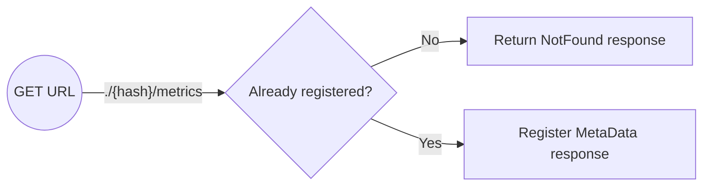

# Visit URL

As an admin, I'd like to see URL statistics.

## User stories

> `TODO`

## API-flow

```mermaid
graph LR
    Visit(( GET URL )) --> |"./{hash}/metrics"| Visit_ExistingUrl

    Visit_ExistingUrl{Already registered?}
    Visit_ExistingUrl --> |No| Visit_ReturnNotFound[Return NotFound response]
    Visit_ExistingUrl --> |Yes| Visit_RegisterVisit[ Register MetaData response ]
```

## Wire-frames

> `TODO`
